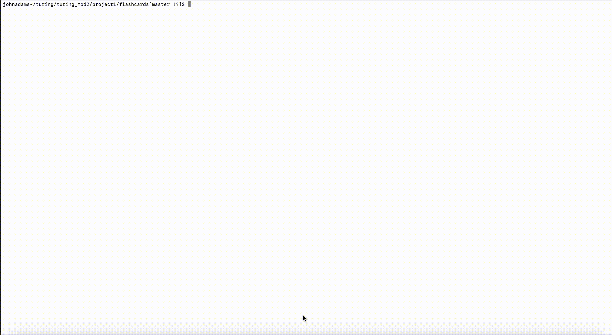

# Mod 2 - Project 1: Flashcards

## Abstract

 - The overall goal of this project was to add code to a partially constructed OOP application with the goal of making it fully functional. The Application is meant to simulate Flashcards via questions/vocab paired with possible multiple choice answers. The program is run and used wihtin Node via the terminal. The user can select an anser and will be told whether they are right or wrong, and the user only gets one guess per question before moving on to the next. The main goal of this project was to begin writing code using TDD as the driving factor in that implementation, as well as refining our skills and ability to efficiently and accurately implement ES6 classes. We wrote comprehensive testing suites for each class prior to constructing the ES6 classes with the learning goal of gaining confidence in how and when to write a test, as well as the proper syntax and implementation of TDD using Mocha and Chai. A side goal of this project was to begin experimenting and using ES6 syntax. 
  A major struggle for me throughout this project has been moving away from writing mainly DOM manipulation JS as well as having an app that runs in the window using HTML and CSS. Having that visual aid coupled with Dev tools to help problem solve has been super helpful and not having that has made trouble shooting harder for me. The testing has helped to fill in that void and is a strong tool in implementing code, but if I get an error on a test and don't know how to fix it then I can not rely on the dev tools to really dig in and figure it out. The dev tools have also been a huge help in really figuring out exactly what is going on and how the code is being executed, and not having that coupled with having a util.js file that I don't fully understand has been difficult. So, relying on the tests more and using tools like console.log has been really helpful in filling that void. 
  
---
 
## GIF

